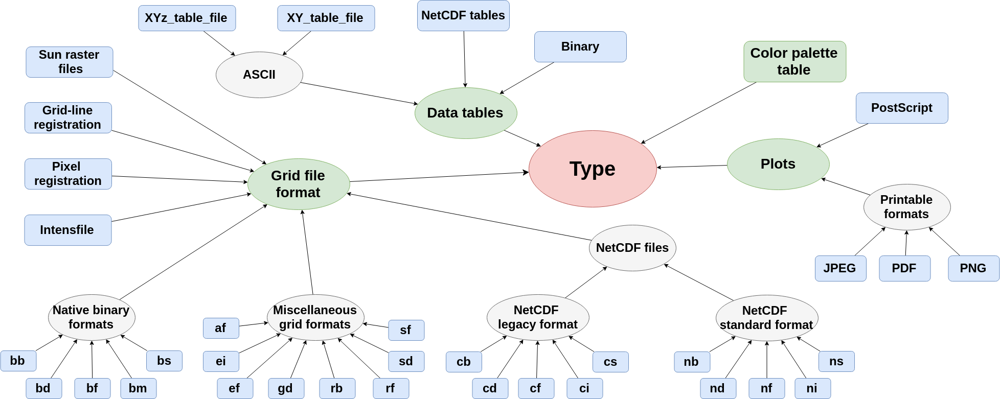

GEO GMT (Generic Mapping Tools)
===============================

This Geovisualization Case Study (using 
`GMT <https://www.generic-mapping-tools.org/>`_ tools) 
will demonstrate the sysnthesis functionality 
provided by APE (the Automated Pipeline Explorer). 

The use case aims to demonstrate the usefulness 
of the synthesis approach for solving a problem 
of map creation. The scenario was demonstrated 
in [1]_, where the full workflows synthesis 
was accomplished in few incremental synthesis 
steps. Some of them are given here for demonstration:

- `E0 <geo_gmt.html#e0-initial-workflow>`_ use case 
  describes the initial workflow sinthesys step, 
  labeled as **E0** in the paper.
- `E1 <geo_gmt.html#e1-additional-constraints>`_ use 
  case extends the initial workflow sinthesys step 
  with additional constraints enforcing better map 
  annotations.

E0 - Initial Workflow
^^^^^^^^^^^^^^^^^^^^^
In order to run the synthesis ``APE-<version>.jar`` 
needs to be available: https://github.com/sanctuuary/APE. 

.. note::
    In order to be able to execute the generated workflows 
    on the machine, GMT set of tools needs to be installed
    (http://gmt.soest.hawaii.edu/projects/gmt/wiki/Installing)
    However, this step is not required for the workflow synthesis, 
    considering that the synthesis of conadidate workflows 
    and their execution are 2 separate steps.

In order to use the APE library from the command line, 
simply run the ``APE-<version>-executable.jar`` file 
using command:

.. code-block:: shell

    java -jar APE-<version>-executable.jar [path_to_ape_configuration_file]

As an example, if you would download the `APE-2.3.0-executable.jar 
<https://repo.maven.apache.org/maven2/io/github/sanctuuary/APE/2.3.0/APE-2.3.0-executable.jar>`_ 
to the root of APE_UseCases repository on your local machine, 
you could run this demo by executing the following command:

.. code-block:: shell

    cd ~/git/APE_UseCases
    java -jar APE-<version>.jar GeoGMT/E0/config.json

.. note::
    In case the execution fails due to the heap space, 

The results of the synthesis would be stored under the directory 
specified in the configuration file (``solutions_dir_path`` parameter). The results of the synthesis would be:

.. code-block:: shell

    solutions_dir_path/solutions.txt - First X candidate solutions in textual format, where X is the number of solutions specified in the config file (``solutions`` parameter)
    solutions_dir_path/Figures/        - Workflow figures corresponding to the first Y solutions, where Y is the number of solutions specified in the config file (``number_of_generated_graphs`` parameter, 0 if not specified))
    solutions_dir_path/Executables/  - Executable shell scripts corresponding to the first Z solution, where Z is the number of solutions specified in the config file (``number_of_execution_scripts`` parameter, 0 if not specified))
    solutions_dir_path/CWL/ - CWL files corresponding to the first Q solution, where Q is the number of solutions specified in the config file (``number_of_cwl_files`` parameter, 0 if not specified)

E1 - Additional Constraints
^^^^^^^^^^^^^^^^^^^^^^^^^^^
By adding more constraints (``constraints_e1.json``), we avoid obtaining workflows that are ambiguous, redundant, or not relevant to
the domain [1]_. 

.. code-block:: shell      uses: actions/checkout@v2

    cd ~/git/APE_UseCases
    java -jar APE-<version>.jar GeoGMT/E1/config.json

Domain Model
^^^^^^^^^^^^
Tool Taxonomy
~~~~~~~~~~~~~

Type Taxonomy
~~~~~~~~~~~~~

|

References
^^^^^^^^^^
.. [1] Kasalica, V., & Lamprecht, A.-L. (2019).
       Workflow discovery through semantic constraints: A geovisualization case study. 
       In Computational science and its applications – ICCSA 2019
       (pp. 473–488), Springer International Publishing,
       https://doi.org/10.1007/978-3-030-24302-9_53
