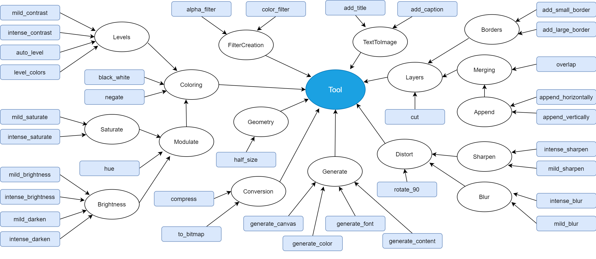
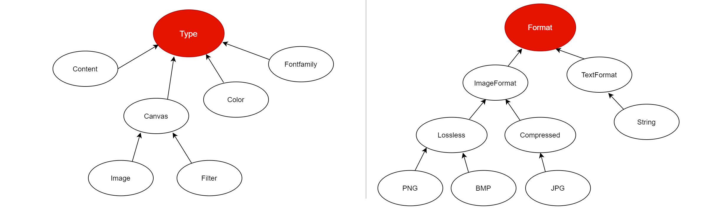

ImageMagick
===========

This is a project used to demonstrate the sysnthesis functionality 
provided by APE.

The use case aims to describe the domain knowledge that has to be 
provided, comprising `Domain ontology <../../specifications/setup.html#domain-model>`_ and 
`Tool annotations <../../specifications/setup.html#tool-annotations-file>`_). In addition 
it will demonstrate the usefulness of the synthesis approach for solving a workflow 
discovery problem with `ImageMagick <https://imagemagick.org/index.php>`_, an open-source 
software suite for displaying, creating, converting and modifying images.

.. note::
    In order to be able to execute the generated workflows 
    on the machine, Imagemagick needs to be installed 
    (https://imagemagick.org/index.php).
    However, this step is not required for the workflow synthesis, 
    considering that the synthesis of conadidate workflows 
    and their execution are 2 separate steps.

Domain Model
^^^^^^^^^^^^
The current use case ontology (see below) contains the 
following structure:

* **thing** (root class in the OWL file)

  * **Tool** (name provided as modulesTaxonomyRoot in config file)
  * **Data** (usage of this class is optional)

    * **Type** (name provided under **dataDimensionsTaxonomyRoots** in config file)
    * **Format** (name provided under **dataDimensionsTaxonomyRoots** in config file)

where the **Tool** represents the root of the operations taxonomy, and 
the **Type** and **Format**, represent roots of taxonomies that classify 
types and formats of data, respectively. The class **Data** can be 
ommited, considering that it is ignored by APE library, however it was 
part of the doman classification and we decided to keep it. 

APE loads the domain ontology from a `file <https://github.com/sanctuuary/APE_UseCases/blob/master/ImageMagick/imagemagick_taxonomy.owl>`_
in Web Ontology Language (OWL) format. Note that the the annotated tools 
(provided in the `tool annotations <../../specifications/setup.html#tool-annotations-file>`_ are included in 
the image below as blue leafs, although they are not part in the OWL file.

|

Example 1
^^^^^^^^^

TODO

Example 2
^^^^^^^^^

TODO
