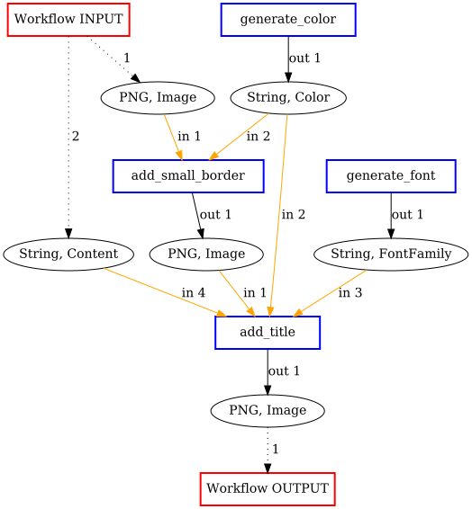
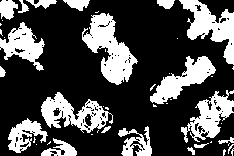
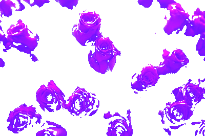

ImageMagick
===========

This is a project used to demonstrate the sysnthesis functionality 
provided by APE.

The use case aims to describe the domain knowledge that has to be 
provided, comprising `Domain ontology <../../specifications/setup.html#domain-model>`_ and 
`Tool annotations <../../specifications/setup.html#tool-annotations-file>`_). In addition 
it will demonstrate the usefulness of the synthesis approach for solving a workflow 
discovery problem with `ImageMagick <https://imagemagick.org/index.php>`_, an open-source 
software suite for displaying, creating, converting and modifying images.

.. note::
    In order to be able to execute the generated workflows 
    on the machine, Imagemagick needs to be installed 
    (https://imagemagick.org/index.php).
    However, this step is not required for the workflow synthesis, 
    considering that the synthesis of conadidate workflows 
    and their execution are 2 separate steps.

In order to use the APE library from the command line, simply run the ``APE-<version>-executable.jar`` file using command:

.. code-block:: shell

    java -jar APE-<version>-executable.jar [path_to_ape_configuration_file]

As an example, if you would download the 
`APE-1.0.1-executable.jar <https://repo.maven.apache.org/maven2/io/github/sanctuuary/APE/1.0.1/APE-1.0.1-executable.jar>`_ 
to the root of APE_UseCases repository on your local machine, 
you could run this demo by executing the following command:

.. code-block:: shell

    cd ~/git/APE_UseCases
    java -jar APE-1.0.1-executable.jar ImageMagick/Example1/config.json

The results of the synthesis would be:

.. code-block:: shell

    ImageMagick/Example1/sat_solutions.txt - First 100 candidate solutions in textual format
    ImageMagick/Example1/Workflows/        - Data-flow figures corresponding to the first solution (config.json specifies that only 1 solution should be found)
    ImageMagick/Example1/Implementations/  - Executable shell scripts corresponding to the first solution

Domain Model
^^^^^^^^^^^^
The current use case ontology (see below) contains the 
following structure:

* **thing** (root class in the OWL file)

  * **Tool** (name provided as modulesTaxonomyRoot in config file)
  * **Data** (usage of this class is optional)

    * **Type** (name provided under **dataDimensionsTaxonomyRoots** in config file)
    * **Format** (name provided under **dataDimensionsTaxonomyRoots** in config file)

where the **Tool** represents the root of the operations taxonomy, and 
the **Type** and **Format**, represent roots of taxonomies that classify 
types and formats of data, respectively. The class **Data** can be 
ommited, considering that it is ignored by APE library, however it was 
part of the doman classification and we decided to keep it. 

APE loads the domain ontology from a `file <https://github.com/sanctuuary/APE_UseCases/blob/master/ImageMagick/imagemagick_taxonomy.owl>`_
in Web Ontology Language (OWL) format. Note that the the annotated tools 
(provided in the `tool annotations <../../specifications/setup.html#tool-annotations-file>`_ are included in 
the image below as blue leafs, although they are not part in the OWL file.

.. image:: imagemagick_tools.png
    :width: 100%

.. image:: imagemagick_types.png
    :width: 100%

|

Example 1
^^^^^^^^^
In this example a postcard is generated by providing a APE with an 
``Image`` and some ``Content`` as input. By setting the right constraint, 
we make sure the ``Image`` will get a border.

Configuration
~~~~~~~~~~~~~

Input / output
--------------
.. code-block:: json

    {
        "inputs": [
            { "Type": ["Image"], "Format": ["PNG"] },
            { "Type": ["Content"] }
        ],
        "outputs": [
            { "Type": ["Image"], "Format": ["LosslessImageFormat"]  }
        ]
    }

Constraints
-----------
At least one implemented tool of the abstract class `Borders` must be used in the solution workflow.

.. code-block:: json

    {
        "constraints": [
            {
                "constraintid": "use_m",
                "parameters": [
                    ["Borders"]
                ]
            }
        ]
    }

Results
~~~~~~~

Generated Workflow
------------------

Generated Script
----------------
.. tabs::

    .. tab:: workflowSolution_0.sh

        .. code-block:: bash

            #!/bin/bash
            if [ $# -ne 2 ]
	            then
		            echo "2 argument(s) expected."
		            exit
            fi
            node579867570=$1
            node1548883689=$2

            # [generate_color]
            read -p "Enter Color [default:Cyan]: " node173380607
            node173380607=${node173380607:-Cyan}

            # [generate_font]
            read -p "Enter FontFamily name [default:Helvetica]: " node1695080704
            node1695080704=${node1695080704:-Helvetica}

            # [add_title]
            node579870453='node579870453.png'
            node579867570_height=$(($(identify -format '%h' $node579867570)/8))
            convert $node579867570 -fill $node173380607 -stroke black -font $node1695080704 -pointsize $node579867570_height -gravity north -annotate 0 "$node1548883689" $node579870453

            # [add_large_border]
            node579871414='node579871414.png'
            node579870453_height=$(($(identify -format '%h' $node579870453)/10))
            convert $node579870453 -bordercolor $node173380607 -border $node579870453_height $node579871414

            echo "1. output is: $node579871414"

Executing the script
--------------------

.. code-block:: bash

    > bash workflowSolution_0.sh input.png "Greetings from the\nNetherlands!"
    > Enter Color [Cyan]: Orange
    > Enter FontFamily name [Helvetica]:
    > output is: node579871414.png

INPUT (input.png):

``add_title`` (node579870453.png)

``add_large_border`` OUTPUT (node579871414.png):

Example 2
^^^^^^^^^
In this example we will try to replace the ``Color`` red by the ``Color`` blue. 

Configuration
~~~~~~~~~~~~~

Input / output
--------------

.. code-block:: json

    {
	    "inputs": [
		    { "Type": ["Image"], "Format": ["JPG"] },
		    { "Type": ["Color"], "Format": ["String"] },
		    { "Type": ["Color"], "Format": ["String"] }
	    ],
	    "outputs": [
		    { "Type": ["Image"] }
	    ]
    }

Constraints
-----------

Using our foreknowledge about images we assume there must be some kind of 
filtering involved, so we add the constraint to use a type ``Filter`` in the 
workflow solution.

After generating multiple workflows we notice that our provided ``Colors`` are 
all being used to add borders to our image, so we add a constraint to make sure 
that ``Border`` tools are not allowed in the workflow solution.

.. code-block:: json

    {
	    "constraints": [
	    {
			    "constraintid": "use_t",
			    "parameters": [
				    ["Filter"]
			    ]
		    },
		    {
			    "constraintid": "nuse_m",
			    "parameters": [
				    ["Borders"]
			    ]
		    },
		    {
			    "constraintid": "next_m",
			    "parameters": [
				    ["cut"],
				    ["overlap"]
			    ]
		    }
	    ]
    }

Results
~~~~~~~

Generated Workflows
-------------------

.. tabs::

    .. tab:: SolutionNo_1_length_4.png

        .. image:: example2/SolutionNo_1_length_4.png
            :width: 400

    .. tab:: SolutionNo_0_length_4.png

        .. image:: example2/SolutionNo_0_length_4.png
            :width: 400

Generated scripts
-----------------

.. tabs::

    .. tab:: workflowSolution_1.sh

        .. code-block:: bash

            #!/bin/bash
            if [ $# -ne 3 ]
                then
                    echo "3 argument(s) expected."
                    exit
            fi
            node539597562=$1
            node173381567=$2
            node173381566=$3

            node19521642='node19521642.png'
            convert $node539597562 -fuzz 35% -fill black +opaque $node173381566 +fuzz -fill white +opaque black $node19521642

            node579869492='node579869492.png'
            convert $node539597562 +level-colors $node173381567, $node579869492

            node579870453='node579870453.png'
            convert $node579869492 $node19521642 -compose multiply -composite -transparent black $node579870453

            node579871414='node579871414.png'
            convert $node539597562 $node579870453 -background none -layers flatten $node579871414

            echo "1. output is: $node579871414"

    .. tab:: workflowSolution_0.sh

        .. code-block:: bash

            #!/bin/bash
            if [ $# -ne 3 ]
                then
                    echo "3 argument(s) expected."
                    exit
            fi
            node539597562=$1
            node173381567=$2
            node173381566=$3

            node579868531='node579868531.png'
            convert $node539597562 +level-colors $node173381566, $node579868531

            node19522603='node19522603.png'
            convert $node579868531 -fuzz 35% -fill black +opaque $node173381567 +fuzz -fill white +opaque black $node19522603

            node579870453='node579870453.png'
            convert $node579868531 $node19522603 -compose multiply -composite -transparent black $node579870453

            node579871414='node579871414.png'
            convert $node579868531 $node579870453 -background none -layers flatten $node579871414

            echo "1. output is: $node579871414"

Executing the script
--------------------

.. code-block:: bash

    > bash workflowSolution_1.sh input.jpg "Blue" "Red"
    > output is: node579871414.png

INPUT (input.jpg):

``color_filter`` (node19521642.png):

``level_colors`` (node579869492.png):

``cut`` (node579870453.png):

``overlap`` (node579871414.png):

