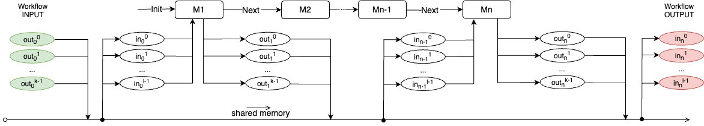

SAT solving
===========

APE uses Mini SAT solver to generate workflows, by relying on the SAT4J library. It creates a CNF (Conjunctive Normal Form) file the given length and gives it to the solver to find the first solution. Other solutions on the same length are found by adding a clause to the CNF file that excludes the previous solution (by adding the negations of the previous solution to the specification). This process is repeated until the desired number of solutions is found. In case not enough solutions are found on the given length, the length is increased and the process is repeated, by generating a new CNF file that encodes the problem on the new length.

The CNF encoding of the problem is used only internally, and comprises a set of clauses expressed as arrays of integers (each state statement is mapped to a positive integer, where negation is expressed as a negative value). However, the user can get access to the CNF file mapped back to the human-readable form by using ``APEDomainSetup.localCNF(path)`` method, and providing the path where the file should be stored. This will write in a file the last CNF encoding that was used in the SAT solver. 

.. code-block:: java

   APE apeFramework = new APE(config);
   apeFramework.getDomainSetup().setWriteLocalCNF("/home/cnf_encoding.txt");

Upon execution, the file will be created in the given path, and the user can inspect the CNF encoding of the problem. The following is an example snippet of the CNF encoding of the problem:

.. code-block:: 

    -http://edamontology.org/Artic(Tool1) empty(Out1.2) 
    -http://edamontology.org/Comet(Tool1) &APE_label&Data&TSV&(In0.0) 
    -http://edamontology.org/halvade_somatic(Tool1) empty(Out1.1)
    -http://edamontology.org/halvade_somatic(Tool1) empty(Out1.2) 
    ...

The first constraint encodes that in case ``Artic`` is used as a first tool (Tool1), the 3rd output of the first tool (Out1.2) is empty, because the tool ``Artic`` has only 2 outputs. The second constraint specifies that in case ``Comet``is used the first input (In0.0) must be of type ``Data`` and format ``TSV``, with just a default ``APE_label`` (data can be labelled to create more strict constraints). The third and fourth constraints specify that in case ``halvade_somatic`` is used, the 2nd (Out1.1) and 3rd (Out1.2) outputs of the first tool must be empty, because the tool ``halvade_somatic`` has only one output.

The indexing of the tools and tool inputs and outputs is visualized in the following figure. Note that the element out\ :sub:`X`\ :sup:`Y` in the figure is encoded as ``OutX.Y`` in CNF:

The initial ``Out`` data instances (Out0.0,...,Out0.k-1) are the workflow inputs (can be seen as "outputs of the environment") and the last ``In`` data instances (In0.0,...,In0.k-1) are the workflow outputs (can be seen as "inputs used by the following environment"). Indexes start from 0. The latest implementation (APE v2.3) was described in the Chapter 4 of `PhD thesis (V. Kasalica) <https://dspace.library.uu.nl/handle/1874/423894>`_.