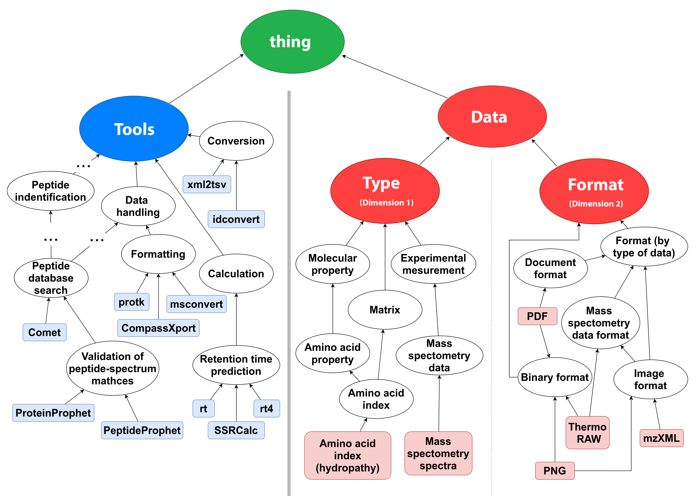
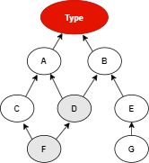

APE Setup
=========

Configuration file
^^^^^^^^^^^^^^^^^^

In order to run APE from the command line, a (JSON) configuration file needs to be provided. 
The API requires a configuration object, which could be created programmatically 
or could also be created from a (JSON) configuration file. 
The file provides references to all required information, that can be classified in the following 3 groups:

1. `Domain model <setup.html#domain-model>`_ - classification of the types and operations in the domain in form 
   of an **ontology** (see `ontology example <../demo/imagemagick.html#ontology>`_ in OWL format) 
   and a **tool annotation file** (see `tool annotations example <../demo/imagemagick.html#tools>`_ in JSON format).
2. *Workflow specification* - including a list of **workflow inputs/outputs** and template-based 
   (see constraint templates) **workflow constraints** (see workflow constraints example)
3. *Parameters* for the synthesis execution, such as the number of desired solutions, 
   output directory, system configurations, etc.

Although the command line tool takes the configuration file as a whole, the configuration can be 
divided into **core** and **run configuration** segments. This is especially visible when working 
with the APE API, where the two are explicitly distinguished.

The **core configuration** (1) provides the crucial information needed to initially setup the environment, 
it can also be seen as *domain model configuration*, as it includes the information regarding the 
domain ontology and tool annotations. Once the framework is initialized, the user can run APE by 
providing a **run configuration**.

The **run configuration** (2) contains all the information needed to execute the workflow synthesis and 
present the results to the user. This information includes the workflow specification (workflow inputs/ 
outputs and workflow constraints) and the execution parameters (such as path to the directory where 
the solutions will be generated, number of solutions needed, etc.).

These configurations are in JSON format and could be joined together, to serve as a setup- as well as 
a run configuration, because APE will only read the required fields. This is visible when APE is run 
from command line.

Examples of configurations can be found under `Use cases and Demos <../demo/demo-overview.html>`_.

Core configuration
~~~~~~~~~~~~~~~~~~

The core configuration is structured as follows:

+-----------------------------------+------------------------------------------------------------------+
| Tag                               | Description                                                      |
+===================================+==================================================================+
| ``ontology_path``                 | Path to the taxonomy file.                                       |
+-----------------------------------+------------------------------------------------------------------+
| ``ontologyPrexifIRI``             | Absolute IRI to identify the elements in the taxonomy file.      |
+-----------------------------------+------------------------------------------------------------------+
| ``toolsTaxonomyRoot``             | Name of the root tool class.                                     |
+-----------------------------------+------------------------------------------------------------------+
| ``dataDimensionsTaxonomyRoots``   | List of roots within the data taxonomy, each sub root represents |
|                                   |                                                                  |
|                                   | data dimension (e.g. data format, data type, etc.).              |
+-----------------------------------+------------------------------------------------------------------+
| ``tool_annotations_path``         | Path to the JSON file that contains basic tool annotations.      |
+-----------------------------------+------------------------------------------------------------------+
| ``strict_tool_annotations``       | True if the tool taxonomy annotation has strict interpretation   |
|                                   | where the inheritance has to be strictly specified, false if we  |
|                                   | should concider all posible data traces (gives more solutions).  |
+-----------------------------------+------------------------------------------------------------------+

JSON example:

.. code-block:: json

   {
      "ontology_path": "./GeoGMT/GMT_UseCase_taxonomy.owl",
      "ontologyPrexifIRI": "http://www.co-ode.org/ontologies/ont.owl#",
      "toolsTaxonomyRoot": "ToolsTaxonomy",
      "dataDimensionsTaxonomyRoots": ["TypesTaxonomy"],
      "tool_annotations_path": "./GeoGMT/tool_annotations.json",
   }

Run configuration
~~~~~~~~~~~~~~~~~

The run configuration is structured as follows:

+-----------------------------------+--------------------------------------------------+-------------------+
| Tag                               | Description                                      | Default           |
+===================================+==================================================+===================+
| ``constraints_path``              | Path to the JSON file containing constraints     | No constraints    |
|                                   |                                                  |                   |
|                                   | representing workflow specification.             |                   |
+-----------------------------------+--------------------------------------------------+-------------------+
| ``solutions_dir_path``            | Path to the file where the results               |                   |
|                                   |                                                  |                   |
|                                   | will be written.                                 |                   |
+-----------------------------------+--------------------------------------------------+-------------------+
| ``inputs[]``                      | Each input represent a single instance that      | No inputs         |
|                                   |                                                  |                   |
|                                   | will be an input to the program.                 |                   |
+-----------------------------------+--------------------------------------------------+-------------------+
| ``inputs[]/{}``                   | Each of the inputs can be described using the    |                   |
|                                   |                                                  |                   |
|                                   | terms from data taxonomy, the tags used          |                   |
|                                   |                                                  |                   |
|                                   | (in our example "TypesTaxonomy" reflects         |                   |
|                                   |                                                  |                   |
|                                   | the corresponding taxonomy sub root).            |                   |
+-----------------------------------+--------------------------------------------------+-------------------+
| ``outputs[]``                     | Each output represent a single instance that     | No outputs        |
|                                   |                                                  |                   |
|                                   | will be an output of the program.                |                   |
+-----------------------------------+--------------------------------------------------+-------------------+
| ``outputs[]/{}``                  | Each of the inputs can be described using        |                   |
|                                   |                                                  |                   |
|                                   | the terms from data taxonomy, the tags           |                   |
|                                   |                                                  |                   |
|                                   | used (in our example "TypesTaxonomy"             |                   |
|                                   |                                                  |                   |
|                                   | reflects the corresponding taxonomy sub root).   |                   |
+-----------------------------------+--------------------------------------------------+-------------------+
| ``solution_length``               | Minimum (``min``) and maximum (``max``) length   |                   |
|                                   |                                                  |                   |
|                                   | from which  solutions should be searched.        |                   |
+-----------------------------------+--------------------------------------------------+-------------------+
| ``max_solutions``                 | Max number of solutions that would be returned.  |                   |
+-----------------------------------+--------------------------------------------------+-------------------+
| ``number_of_execution_scripts``   | Number of executable scripts that will be        | 0                 |
|                                   |                                                  |                   |
|                                   | generated.                                       |                   |
+-----------------------------------+--------------------------------------------------+-------------------+
| ``number_of_generated_graphs``    | Number of workflow figures that will be          | 0                 |
|                                   |                                                  |                   |
|                                   | generated.                                       |                   |
+-----------------------------------+--------------------------------------------------+-------------------+
| ``tool_seq_repeat``               | True if multiple solutions can comprise the      | True              |
|                                   | same sequence of tools                           |                   |
+-----------------------------------+--------------------------------------------------+-------------------+
| ``timeout(sec)``		    | Timeout for the synthesis run (in seconds)       | 300               |
+-----------------------------------+--------------------------------------------------+-------------------+
| ``debug_mode``                    | True for debug command line output               | False             |
+-----------------------------------+--------------------------------------------------+-------------------+
| ``use_workflow_input``            | ``ALL`` if all the workflow inputs have to be    | ONE               |
|                                   |                                                  |                   |
|                                   | used,``ONE`` if one of the workflow inputs       |                   |
|                                   |                                                  |                   |
|                                   | should be used or ``NONE`` if none of the        |                   |
|                                   |                                                  |                   |
|                                   | workflow inputs has to be used.                  |                   |
+-----------------------------------+--------------------------------------------------+-------------------+
| ``use_all_generated_data``        | ``ALL`` if all the generated data has to be      | ALL               |
|                                   |                                                  |                   |
|                                   | used, ``ONE`` if one of the data instances that  |                   |
|                                   |                                                  |                   |
|                                   | are generated as output, per tool, has to be     |                   |
|                                   |                                                  |                   |
|                                   | used or ``NONE`` if none of the data instances   |                   |
|                                   |                                                  |                   |
|                                   | is obligatory to use.                            |                   |
+-----------------------------------+--------------------------------------------------+-------------------+

JSON example:

.. code-block:: json

   {
      "constraints_path": "./GeoGMT/E0/constraints_e0.json",
      "solutions_dir_path": "./GeoGMT/E0/",
      "inputs": [
         {
            "TypesTaxonomy": ["XYZ_table_file"]
         }
      ],
      "outputs": [
         {
            "TypesTaxonomy": ["PostScript"]
         }
      ],
      "solution_length": { 
         "min": 1, 
         "max": 10 
      },
      "max_solutions": "10",
      "number_of_execution_scripts": "0",
      "number_of_generated_graphs": "5",
      "tool_seq_repeat": "true",
      "debug_mode": "false",
      "use_workflow_input": "all",
      "use_all_generated_data": "all",
   }

Domain Model
^^^^^^^^^^^^

APE loads the domain ontology from a file in Web Ontology Language 
(OWL) format. The domain ontology consists of taxonomic classifications 
of the data and operations in the application domain, and provides 
a controlled  vocabulary  that  allows  for  different  abstraction
levels  of  its  elements.

A graphical representation of an example ontology can be found below (Fig. 1_).

The ontology is used to classify tools and data types into 2 different categories. 
General structure is that the main class **"thing"** has 2 subclasses, **Tools** and 
**Data** taxonomies. Furthermore, Data taxonomy consists of multiple subtaxonomies, 
where each represents a **dimension** of data. In the following example we discuss 
2 different dimensions of data, namely, data *Type* and data *Format*.

- **thing** (root class in the OWL file)

  - **Tools Taxonomy** (URI provided as ``modulesTaxonomyRoot`` in config file)
  - **Type Taxonomy** (URI provided under ``dataDimensionsTaxonomyRoots`` in config file)
  - **Format Taxonomy** (URI provided under ``dataDimensionsTaxonomyRoots`` in config file)

**Tools Taxonomy** consists of terms that describes operations from the domain, these are 
called abstraction operations and they usually group concrete operations. **Type Taxonomy** 
consists of actual data types from the domain, as well as the abstraction classes that 
subsume them. **Format Taxonomy** consists of actual data Format from the domain, as well 
as the abstraction classes that subsume them.

Idea behind using a Format Taxonomy, is that a certain data instance require both, 
*data type* and *data format* to be identified. Thus, these are called dimensions of data. 
Having more than one data dimension is optional. Some use cases only use one data dimension 
(e.g. `GeoGMT <../demo/geo_gmt/geo_gmt.html>`_), while some can have more than two.

.. note::
   Encoding supports explicit subclass relations in RDF format. The rest of the OWL file annotations will be omitted.

.. _1:

**Fig. 1.**  (`source <https://doi.org/10.1007/978-3-030-50436-6_34>`_)

Tool Annotations
^^^^^^^^^^^^^^^^

The Tool Annotations file is a collection of tools that have been semantically 
annotated, according to their inputs and outputs, based on the terms from the ontology. 

Structure
~~~~~~~~~

The file has the following structure:

.. code-block:: shell

   functions
      +function
         ID
         label
            taxonomyOperations[]
         ?inputs[]
            +input
               +dataSubTaxonomyRoot:[taxonomyTerm]
         ?outputs[]
            +output
               +dataSubTaxonomyRoot:[taxonomyTerm]
         ?implementation
            code

where (+) requires 1 or more, (?) requires 0 or 1 and no sign requires existence of exactly 1 such tag.

Regarding the semantics:

+-------------------------+----------------------------------------------------+
| Tag                     | Description                                        |
+=========================+====================================================+
| ``function``            | an implementation/instance of a tool               |
+-------------------------+----------------------------------------------------+
| ``ID``                  | unique identifier of the tool                      |
+-------------------------+----------------------------------------------------+
| ``label``               | display label of the tool implementation           |
+-------------------------+----------------------------------------------------+
| ``taxonomyOperations``  | operations from the tool taxonomy (#taxonomy-file) |
|                         |                                                    |
|                         | that the current function implements               |
+-------------------------+----------------------------------------------------+
| ``input``               | a single input of the workflow                     |
+-------------------------+----------------------------------------------------+
| ``output``              | a single output of the workflow                    |
+-------------------------+----------------------------------------------------+
| ``dataSubTaxonomyRoot`` | data type that describes the input/output          |
|                         |                                                    |
|                         | (each taxonomyTerm from the [taxonomyTerm] list    |
|                         |                                                    |
|                         | has to belong to the corresponding subTaxonomy)    |
+-------------------------+----------------------------------------------------+
| ``code``                | code that will be used to implement the workflow   |
|                         |                                                    |
|                         | as a script                                        |
+-------------------------+----------------------------------------------------+

Example
~~~~~~~

The following example annotated the tool ``compress``, which takes as 
input any ``Image`` (Type) of any Format and outputs an Image in the JPG 
format. See `ImageMagick/tool_annotations.json <https://github.com/sanctuuary/APE_UseCases/blob/master/ImageMagick/tool_annotations.json>`_
for more annotated tools.

.. code-block:: json

   {
      "label": "compress",
      "id": "compress",
      "taxonomyOperations": ["Conversion"],
      "inputs": [
         { "Type": ["Image"] }
      ],
      "outputs": [
         { "Type": ["Image"], "Format": ["JPG"] }
      ],
      "implementation": { 
         "code": "@output[0]='@output[0].jpg'\n
                  convert $@input[0] $@output[0]\n" 
      }
   }

Referencing the Domain Model
~~~~~~~~~~~~~~~~~~~~~~~~~~~~
A reference to a class (or a set of classes) in the domain ontology 
must be in array format. This array represents a conjunction of classes 
from the ontology. For example, given the ontology below. Specifying 
``["A", "B"]`` as input for your tool makes sure only inputs of type 
``D`` and ``F`` are allowed.

This way of referencing domain model classes is used in annotating 
the tools as well as the input/output annotated in the configuration file.

Code Implementation
~~~~~~~~~~~~~~~~~~~

The code specified in the tool annotation could be used to constuct a 
script that executes the workflow. APE keeps track of the naming of 
the in- and output variables from annotated tools. The ``@output[0]`` references to 
the variable name of the first input specified in the 
``inputs`` tag.

For example, take a look at the implementation of a tool called ``add``:

.. code-block:: json

   {
      "label": "add",
      "id": "add",
      "taxonomyOperations": ["Math"],
      "inputs": [
         { "Type": ["Number"] }
         { "Type": ["Number"] }
      ],
      "outputs": [
         { "Type": ["Number"]}
      ],
      "implementation": {
         "code": "@output[0] = $@input[0] + $@input[1]"
      }
   }

This could result in the following script, where ``node001`` and ``node002`` 
already have been instantiated, so ``node001`` is either the user input, 
or the output of a previous tool.

.. code-block:: shell

   node003 = $node001 + $node002

Constraints File
^^^^^^^^^^^^^^^^

As an example we will present one of the constraint templates, namely "if then generate type" is represented as follows:

.. code-block:: json

	{
	   "constraintid": "gen_ite_t",
	   "description": "If we have generated data type ``${parameter_1}``, 
                           then generate type ``${parameter_2}`` subsequently.",
	   "parameters": [
		  ["${parameter_1}"],
		  ["${parameter_2}"]
	   ]
	}

where both ``"${parameter_1}"`` and ``"${parameter_2}"`` represent a sequence of one or more data terms. The following encoding represents a use of such constraint in practice (tag ``"description"`` is not obligatory):

.. code-block:: json

   {
      "constraintid": "gen_ite_t",
      "parameters": [
         ["article","docx"],
         ["article","pdf"]
      ]
   }

The constraint is interpreted as: 
"If an **article** in **docx** format was generated, then an **article** in **pdf** format has to be generated subsequently."

All pre-defined constraints that can be used:

=============  ===========
ID             Description
=============  ===========
``ite_m``      If we use module ``${parameter_1}``, 

               then use ``${parameter_2}`` subsequently.
-------------  -----------
``itn_m``      If we use module ``${parameter_1}``, 

               then do not use ``${parameter_2}`` subsequently.
-------------  -----------
``depend_m``   If we use module ``${parameter_1}``, 

               then we must have used ``${parameter_2}`` prior to it.
-------------  -----------
``next_m``     If we use module ``${parameter_1}``, 

               then use ``${parameter_2}`` as a next module in the sequence.
-------------  -----------
``prev_m``     If we use module ``${parameter_1}``, 

               then we must have used ``${parameter_2}`` as a previous module in the sequence.
-------------  -----------
``use_m``      Use module ``${parameter_1}`` in the solution.
-------------  -----------
``nuse_m``     Do not use module ``${parameter_1}`` in the solution.
-------------  -----------
``last_m``     Use ``${parameter_1}`` as last module in the solution.
-------------  -----------
``use_t``      Use type ``${parameter_1}`` in the solution.
-------------  -----------
``gen_t``      Generate type ``${parameter_1}`` in the solution.
-------------  -----------
``nuse_t``     Do not use type ``${parameter_1}`` in the solution.
-------------  -----------
``ngen_t``     Do not generate type ``${parameter_1}`` in the solution.
-------------  -----------
``use_ite_t``  If we have used data type ``${parameter_1}``, 

               then use type ``${parameter_2}`` subsequently.
-------------  -----------
``gen_ite_t``  If we have generated data type ``${parameter_1}``, 

               then generate type ``${parameter_2}`` subsequently.
-------------  -----------
``use_itn_t``  If we have used data type ``${parameter_1}``, 

               then do not use type ``${parameter_2}`` subsequently.
-------------  -----------
``gen_itn_t``  If we have generated data type ``${parameter_1}``, 

               then do not generate type ``${parameter_2}`` subsequently.
=============  ===========

